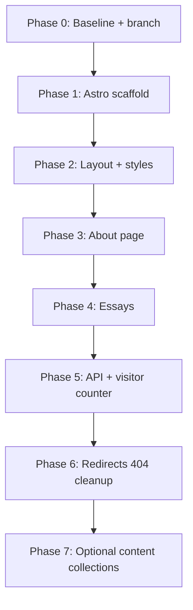

# Next.js → Astro migration plan

**Branch:** `cursor/next-to-astro-migration-9213`  
**Base:** `main`  
**Deploy target:** Vercel (unchanged)  
**Success criterion:** Pixel- and behavior-parity with the current Next.js site on all supported viewports, in light and dark mode.

This document is the source of truth for phased execution. Implementation commits land only on the migration branch until the migration is merged.

---

## Goals and constraints

| Goal | How we enforce it |
|------|-------------------|
| Visual parity | Browser validation + screenshots at each phase gate (see [Visual regression checklist](#visual-regression-checklist)) |
| Behavioral parity | Manual interaction script + Vitest for portable logic |
| SEO / metadata | Match `<title>`, favicon, viewport per route |
| Deploy on Vercel | `@astrojs/vercel` hybrid adapter; keep `BLOB_READ_WRITE_TOKEN` |
| Minimal scope creep | No redesign, no content changes, no new features during migration |

**Out of scope for this migration**

- Refactoring card grid logic beyond what Astro requires
- Moving artifact videos to a CDN (paths stay `/artifacts/*`)
- Replacing remark with MDX unless required for parity
- Content Collections refactor (optional Phase 7 stretch; not required for parity)

---

## Target architecture

```
src/
  layouts/
    Layout.astro          # html shell, theme script, global CSS, ThemeToggle island
  pages/
    index.astro           # redirect → /about (or astro.config redirect)
    about.astro
    essays/[slug].astro
    404.astro
    api/
      visitor-count.ts    # prerender: false
  styles/
    global.css            # moved from app/globals.css
components/               # React islands (unchanged paths where possible)
lib/                      # posts, buildCardGridItems, page-search, utils
content/essays/           # unchanged markdown + frontmatter
public/                   # favicon, artifacts media
astro.config.mjs
```

**Astro config (decisions locked for implementation)**

| Setting | Value | Reason |
|---------|-------|--------|
| `output` | `'hybrid'` | Static pages + one dynamic API route |
| Adapter | `@astrojs/vercel` | Same platform; maps API to serverless |
| Integrations | `@astrojs/react`, `@astrojs/tailwind` | Match current Tailwind + React islands |
| Essay markdown | Option A: keep `remark` + HTML string in Phase 4 | Lowest risk for identical `article` markup |
| Content path | Keep `content/essays/` + `lib/posts.ts` in Phases 1–6 | Vitest stays green without rewrite |

---

## Browser validation protocol

Every phase that touches UI **must** pass this protocol before the phase is marked complete. Use the **Next.js baseline on `main`** until Phase 1 ships Astro; after Phase 1, compare **migration branch** builds against screenshots captured from `main` at plan kickoff.

### Environment

```bash
npm install
npm run dev          # Next baseline: port 3000
# After Astro scaffold:
npm run dev          # Astro: default port 4321 unless configured to 3000
```

For parity testing, prefer **production builds** at phase gates:

```bash
npm run build && npm run preview
```

Preview more closely matches Vercel CSS bundling and static asset paths.

### Viewports (capture all)

| ID | Width | Represents |
|----|-------|------------|
| `mobile` | 390×844 | Phone |
| `tablet` | 768×1024 | iPad portrait |
| `desktop` | 1280×800 | Laptop |
| `wide` | 1536×900 | Large display |

### Routes

| Route | Required states |
|-------|-----------------|
| `/` | Confirms redirect to `/about` |
| `/about` | Light + dark; all card filters; footer visible |
| `/essays/purpose-of-writing` | Light + dark; long-form layout; back link |
| `/essays/nonexistent-slug` | 404 page |
| `/api/visitor-count` | JSON response (network tab; 500 acceptable locally without token) |

### Interaction script (manual, every phase gate)

Run on `/about` unless noted.

1. **Theme**
   - Hard refresh in dark preference → no wrong icon flash before hydration
   - Toggle light ↔ dark → colors match baseline; icon swaps Sun/Moon
   - Reload → persisted theme from `localStorage`

2. **Card grid**
   - Tabs: All → Projects → Music → All
   - Confirm card count, order, titles, date labels match baseline
   - Music cards: hover/preview video behavior (if media present in env)
   - Projects cards: navigate to essay; back link returns to `/about`

3. **CMD+K search** (`Ctrl/Cmd+K`)
   - Open palette; search a word from intro blurb (e.g. "optimist")
   - Select result → scroll + highlight pulse (`.page-search-hit`)
   - Escape closes palette

4. **Visitor counter**
   - Footer shows `N visits` after load (fade-in)
   - With `BLOB_READ_WRITE_TOKEN` on preview deploy: count increments once per session

5. **External links**
   - Intro Reuters/Meta links open in new tab with correct underline/wrap

6. **Essay page**
   - Title color (`text-yellow`), date line, excerpt rule (>500 words)
   - Markdown elements: headings, lists, blockquote, code, links

### Visual regression checklist

For each viewport × theme × route in the table above:

- [ ] Full-page screenshot saved to `docs/migration-screenshots/<phase>/<route>-<viewport>-<theme>.png`
- [ ] Side-by-side review against baseline (no layout shift in header/footer/grid)
- [ ] Computed font family includes Inter stack
- [ ] No horizontal scroll at viewport width
- [ ] Theme toggle position: fixed bottom-right, same size/shadow

**Automated capture (repeatable):**

```bash
# Next baseline (port 3000)
npm run screenshots:baseline

# Astro build under test (port 4321 or 3000)
BASE_URL=http://localhost:4321 OUT_DIR=docs/migration-screenshots/phase-N npm run screenshots:baseline
```

Compare PNGs in `docs/migration-screenshots/baseline/` vs the phase folder (visual diff or side-by-side in PR).

**Agent tooling:** Use browser automation (CDP / computer-use) for the interaction script above; record a short demo video for Phase 6 sign-off.

### Automated checks (every commit on migration branch)

```bash
npm run lint
npm run test
npm run build
```

---

## Phase overview



Each phase ends with: **commit → push → browser gate → update checklist in this doc**.

---

## Phase 0 — Baseline capture and branch setup

**Status:** Complete

### Tasks

- [x] Create branch `cursor/next-to-astro-migration-9213`
- [x] Add this plan (`docs/astro-migration-plan.md`)
- [x] `npm install && npm run build` (on migration branch, Next.js still active)
- [x] Capture baseline screenshots (24 PNGs + `redirect-root.json`) in `docs/migration-screenshots/baseline/`
- [x] Baseline metrics: `npm run test` — 13 tests passed; `npm run build` — succeeded
- [x] Local env: `BLOB_READ_WRITE_TOKEN` not required for migration work; API returns 500 with `count: 0` without it

**Baseline capture command:**

```bash
npm run dev   # port 3000
npm run screenshots:baseline
```

### Exit criteria

- [x] Baseline screenshot set committed on migration branch
- [x] Next.js production build succeeds

### Deliverables

- `docs/migration-screenshots/baseline/*`
- This plan committed

---

## Phase 1 — Astro scaffold (no user-visible change)

**Goal:** Astro builds alongside removal of Next entrypoints, without shipping broken deploy.

### Tasks

1. Add dependencies: `astro`, `@astrojs/vercel`, `@astrojs/react`, `@astrojs/tailwind`
2. Create `astro.config.mjs`:
   - `output: 'hybrid'`
   - `adapter: vercel()`
   - `integrations: [react(), tailwind()]`
   - Redirect `/` → `/about` (307)
3. Create minimal `src/pages/about.astro` placeholder (“migration in progress”) behind env flag **or** skip deploy until Phase 3 — **prefer not merging to main until Phase 6**
4. Update `package.json` scripts: `dev`, `build`, `preview`
5. Remove `next`, `eslint-config-next`; add `eslint-plugin-astro`
6. Update `tsconfig.json` (remove Next plugin; include `src/`)
7. Update `.gitignore`: `.astro/`, `dist/`
8. Update `AGENTS.md` commands table

### Exit criteria

- `npm run build` succeeds (placeholder pages acceptable)
- `npm run test` still passes (lib unchanged)
- Next.js artifacts removed from active scripts

### Browser gate

- Not required (no parity claim yet)

---

## Phase 2 — Global layout, fonts, and styles

**Goal:** Shared shell matches Next `app/layout.tsx` + `globals.css`.

### Tasks

1. Move `app/globals.css` → `src/styles/global.css` (byte-identical content first)
2. Create `src/layouts/Layout.astro`:
   - `<html lang="en">` with Inter (use `@fontsource-variable/inter` or self-hosted woff2 in `public/fonts/`)
   - Inline theme-init script (`is:inline`) — copy from current `layout.tsx`
   - `<main class="...">` wrapper classes match
   - `<ThemeToggle client:load />`
3. Update `tailwind.config.ts` content paths for `src/**/*.{astro,ts,tsx}`
4. Port metadata defaults (title template, description, favicon, viewport)
5. Delete `app/layout.tsx` only after Layout.astro verified

### Exit criteria

- `/about` stub page renders with correct background, font, theme toggle, and toggle persistence
- Light/dark CSS variables match baseline screenshots

### Browser gate

- [ ] `/about` stub: all viewports × both themes
- [ ] Theme toggle: no hydration flash (compare to baseline video if needed)

---

## Phase 3 — About page parity

**Goal:** `/about` visually and behaviorally identical to Next.

### Tasks

1. Create `src/pages/about.astro`:
   - Static markup for intro blurb (`RainbowText`, `ExternalLink` — convert to `.astro` or tiny React islands)
   - `const items = buildCardGridItems()` at build time
   - `<AboutCardGridWithFooter client:load items={items}>` with footer slot content (contact links + `VisitorCounter` placeholder until Phase 5)
2. Port components with minimal edits:
   - Replace `next/link` in `Card.tsx` with `<a href>`
   - Keep `CardGridClient`, `CardVideo`, `EditorThumbnail` as React islands
3. Add `<PageSearchPalette client:load />`
4. Verify `public/artifacts/*` assets present in deploy environment (document if LFS/external)

### Exit criteria

- About page matches baseline screenshots at all viewports/themes
- Card filter tabs and animations behave identically
- CMD+K search works on page content
- Essay card links navigate correctly

### Browser gate (full interaction script on `/about`)

---

## Phase 4 — Essay routes

**Goal:** `/essays/[slug]` static generation matches Next.

### Tasks

1. Create `src/pages/essays/[slug].astro` with `getStaticPaths()` from `getPostSlugs()`
2. Port essay template markup from `app/essays/[slug]/page.tsx`
3. Keep markdown pipeline: `remark` + `remark-html` + `set:html` (or equivalent) so `article` HTML structure matches
4. Preserve: `formatPostDate`, excerpt visibility rule, back link classes
5. Per-essay `<title>` from frontmatter
6. Create `src/pages/404.astro` from `app/not-found.tsx`

### Exit criteria

- `/essays/purpose-of-writing` matches baseline
- Invalid slug returns 404 matching baseline
- `npm run test` passes

### Browser gate

- [ ] Essay page: all viewports × themes
- [ ] Back link → `/about`
- [ ] 404 route

---

## Phase 5 — Visitor count API and footer

**Goal:** API + client counter match Next behavior.

### Tasks

1. Port `app/api/visitor-count/route.ts` → `src/pages/api/visitor-count.ts`
   - `export const prerender = false`
   - Map `cookies()` to Astro `cookies` API
   - Preserve: session cookie, blob paths, cache TTL, env buckets
2. Enable `VisitorCounter` island on about page
3. Confirm preview deployment on Vercel has `BLOB_READ_WRITE_TOKEN`

### Exit criteria

- Footer counter appears with fade-in
- Preview deploy: new session increments count; repeat visit within 30 min does not
- Local without token: graceful 500, `count: 0`, site otherwise works (existing policy)

### Browser gate

- [ ] Counter visible on `/about`
- [ ] Network tab shows `/api/visitor-count` response shape

---

## Phase 6 — Redirects, cleanup, and cutover

**Goal:** Remove Next.js entirely; ready to merge.

### Tasks

1. Remove `app/` directory and `next.config.js`
2. Remove `next-env.d.ts` from repo and `.gitignore` entry if obsolete
3. Configure `src/pages/index.astro` or `astro.config` redirect `/` → `/about`
4. Update `components.json` paths (`css`, `rsc: false`)
5. Update `README.md` and `AGENTS.md`
6. Final full baseline comparison (all screenshots)
7. Open PR: `cursor/next-to-astro-migration-9213` → `main`
8. Vercel preview URL review before merge

### Exit criteria

- No `next` in `package.json`
- Full browser protocol pass
- `npm run lint && npm run test && npm run build` green
- PR approved after preview deploy check

### Browser gate (complete protocol + optional recorded walkthrough)

---

## Phase 7 — Optional follow-up (post-merge)

Not required for parity.

- Migrate essays to Astro Content Collections
- Replace `remark` with Astro markdown + rehype plugins
- Consolidate duplicate date-formatting if collections provide typed dates
- Evaluate `ClientRouter` for view transitions between about ↔ essays

---

## File migration map

| Next.js path | Astro path | Phase |
|--------------|------------|-------|
| `app/layout.tsx` | `src/layouts/Layout.astro` | 2 |
| `app/globals.css` | `src/styles/global.css` | 2 |
| `app/about/page.tsx` | `src/pages/about.astro` | 3 |
| `app/essays/[slug]/page.tsx` | `src/pages/essays/[slug].astro` | 4 |
| `app/not-found.tsx` | `src/pages/404.astro` | 4 |
| `app/page.tsx` | `astro.config` redirect | 6 |
| `app/api/visitor-count/route.ts` | `src/pages/api/visitor-count.ts` | 5 |
| `components/*` | `components/*` (islands) | 3–5 |
| `lib/*` | `lib/*` | 1–4 |
| `content/essays/*` | unchanged | — |
| `public/*` | unchanged | — |
| `tests/*` | unchanged (update imports if `lib` moves) | 1–4 |

---

## Risk register

| Risk | Mitigation |
|------|------------|
| Hydration mismatch on theme toggle | Keep inline `theme-init` script; keep `mounted` guard in `ThemeToggle` |
| Card grid layout shift | Do not rewrite animation logic; port as single React island |
| Markdown HTML differs | Keep `remark-html` output; compare essay DOM in browser devtools |
| Missing artifact videos in clone | Document asset setup; verify music tab on deploy with assets |
| API cookie API differences | Test session increment on Vercel preview with token |
| Port change (3000 → 4321) | Document in AGENTS.md; optional `server.port: 3000` in astro config |
| shadcn/Radix in Astro | Keep as React islands only; do not convert dialog to Astro |

---

## PR and merge strategy

1. All work on `cursor/next-to-astro-migration-9213` only.
2. Phase commits should be small and named: `migration(phase-N): <description>`.
3. Do not merge to `main` until Phase 6 browser gate passes on Vercel preview.
4. After merge: delete branch; update Vercel project framework preset to Astro if not auto-detected.

---

## Progress tracker

| Phase | Status | Browser gate | Commit |
|-------|--------|--------------|--------|
| 0 | Complete | N/A (baseline captured via Playwright) | Initial plan + screenshots |
| 1 | Pending | N/A | — |
| 2 | Pending | Required | — |
| 3 | Pending | Required | — |
| 4 | Pending | Required | — |
| 5 | Pending | Required | — |
| 6 | Pending | Required (full) | — |
| 7 | Optional | — | — |

_Update this table as phases complete._
